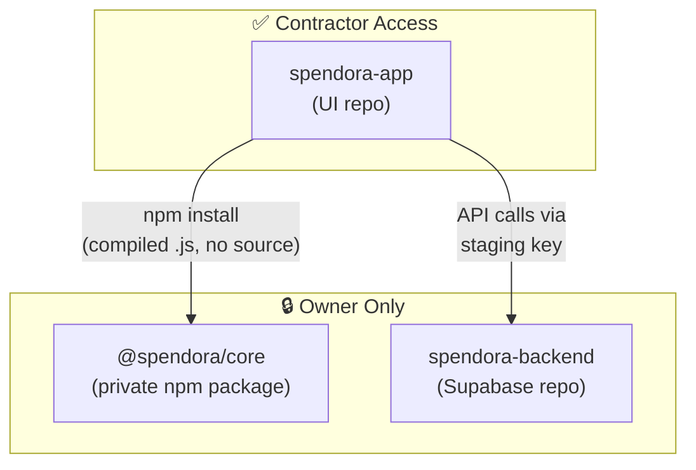

# Spendora Multi-Repo Codebase Separation Plan

Separate the Spendora monolith into 3 repos so a contractor can build UI screens without access to business logic, AI prompts, or backend infrastructure.

## Architecture Overview



---

## Repo 1: `spendora-app` (Contractor gets this)

Everything visual — screens, components, styles, assets, navigation.

| Current Path | What It Contains |
|---|---|
| `app/` | All screens (tabs, auth, scanner, etc.) |
| `components/` | UI components (GlassCard, MerchantLogo, modals, etc.) |
| `styles/` | Extracted StyleSheet files |
| `config/categoryConfig.ts` | Category display config (labels, colors, icons) |
| `constants/NeoTheme.ts` | Theme tokens |
| `constants/theme/` | Theme config |
| `hooks/` | Color scheme hooks |
| `assets/` | Images, fonts |
| `app.json`, `tsconfig.json`, `package.json` | Project config |

> [!IMPORTANT]
> Screens will import stores and parsers from `@spendora/core` instead of relative paths.
> Example: `import { useReceiptStore } from '@spendora/core'`

---

## Repo 2: `@spendora/core` (Private npm package — Owner only)

All business logic, data stores, AI parsing, and database queries. Published as a **compiled JavaScript package** so the contractor gets type definitions but zero source code.

| Current Path | What It Contains | Why Protected |
|---|---|---|
| `store/*.ts` | All 6 Zustand stores | Revenue logic, caching strategies |
| `lib/aiParser.ts` | AI prompt engineering | Core IP — parsing intelligence |
| `lib/cloudParser.ts` | Cloud parsing orchestration | API key handling, parsing flow |
| `lib/receiptParser.ts` | Receipt parsing pipeline | Core IP |
| `lib/itemAnalyticsQueries.ts` | Supabase analytics queries | Database schema knowledge |
| `lib/blurDetection.ts` | Image quality detection | Proprietary algorithm |
| `lib/supabase.ts` | Supabase client init | Contains connection config |
| `lib/AuthContext.tsx` | Auth provider | Auth flow, token handling |
| `lib/hooks.ts` | Data-fetching hooks | Query patterns |
| `lib/currencySymbol.ts` | Currency utilities | Can stay here or move to app |
| `types/supabase.ts` | Generated DB types | Reveals full schema |
| `db/schema.sql` | Local DB schema | Database structure |

### What the contractor sees after `npm install @spendora/core`:
```
node_modules/@spendora/core/
├── dist/
│   ├── index.js          ← Compiled, minified, unreadable
│   └── index.d.ts        ← TypeScript types (function signatures only)
└── package.json
```

### Example `index.d.ts` (what contractor gets):
```typescript
// Stores
export declare function useReceiptStore(): {
  receipts: Receipt[];
  loading: boolean;
  fetchReceipts: (force?: boolean) => Promise<void>;
  addReceipt: (receipt: Receipt) => Promise<void>;
  removeReceipt: (id: string) => Promise<void>;
  availableCategories: string[];
  receiptSuperCategoryMap: Record<string, string>;
  fetchCategoryData: (force?: boolean) => Promise<void>;
  // ... etc
};

// Auth
export declare function AuthProvider({ children }: { children: ReactNode }): JSX.Element;
export declare function useAuth(): { user: User | null; isLoading: boolean };

// Types
export interface Receipt { id: string; store_name?: string; /* ... */ }
```

They can call every function but never see the implementation.

---

## Repo 3: `spendora-backend` (Owner only)

Everything server-side. Contractor never touches this.

| Current Path | What It Contains |
|---|---|
| `supabase/functions/parse-receipt/` | GPT-4o receipt parsing edge function |
| `supabase/functions/normalize-items/` | 3-level taxonomy classifier |
| `supabase/migrations/` | All SQL migrations |
| `supabase/config.toml` | Supabase project config |
| `.env` | API keys, secrets |

---

## Migration Steps

### Phase 1 — Extract `@spendora/core`

1. Create new private GitHub repo `spendora-core`
2. Move `store/`, `lib/`, `types/`, `db/` into it
3. Add build tooling (`tsup` or `tsc`) to compile to `dist/`
4. Add `index.ts` barrel file re-exporting everything
5. Publish to GitHub Packages (private npm registry)

### Phase 2 — Extract `spendora-backend`

1. Create new private GitHub repo `spendora-backend`
2. Move `supabase/` folder + `.env` into it
3. Set up CI/CD for edge function deploys

### Phase 3 — Clean up `spendora-app`

1. Remove `store/`, `lib/`, `types/`, `db/`, `supabase/` from main repo
2. Add `@spendora/core` as npm dependency
3. Update all import paths: `@/store/...` → `@spendora/core`
4. Add `.env.staging` with staging-only Supabase keys
5. Verify app builds and runs

### Phase 4 — Contractor onboarding

1. Invite contractor to `spendora-app` repo only
2. Provide staging Supabase URL + anon key
3. Share type docs (auto-generated from `index.d.ts`)

---

## Security Checklist

| Threat | Mitigation |
|---|---|
| Contractor reads store logic | Compiled `.js` only, no source maps |
| Contractor reverse-engineers AI prompts | Prompts live in edge functions (server-side), never shipped to client |
| Contractor copies database schema | Types exported are minimal interfaces, not full schema |
| Contractor uses production data | Staging-only API keys, separate Supabase project |
| Contractor pushes malicious code | PR reviews required, CODEOWNERS on `spendora-app` |

---

## Effort Estimate

| Phase | Effort | Complexity |
|---|---|---|
| Phase 1 (Extract core) | ~4 hours | Medium — barrel exports + build config |
| Phase 2 (Extract backend) | ~1 hour | Low — just move files |
| Phase 3 (Clean up app) | ~2 hours | Medium — update 30+ import paths |
| Phase 4 (Onboarding) | ~1 hour | Low — docs + access |
| **Total** | **~8 hours** | |

> [!TIP]
> You don't have to do all phases at once. **Phase 2 (backend)** can be done immediately with zero code changes — just move the `supabase/` folder to a private repo. That alone protects your AI prompts and database schema.
